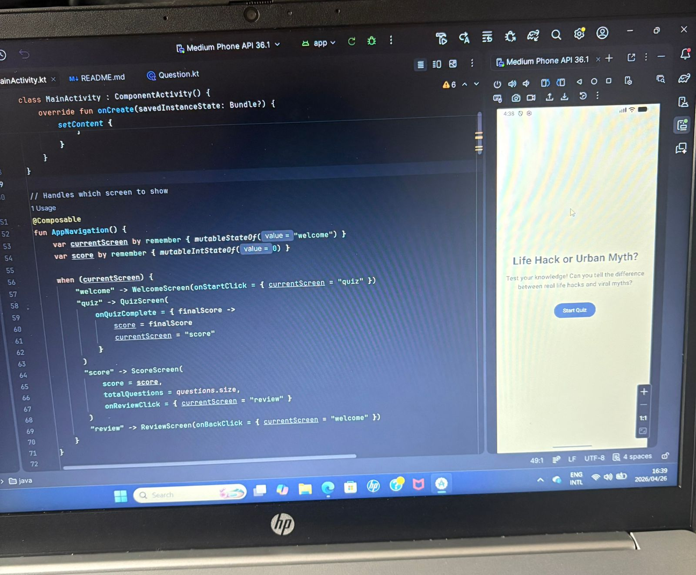
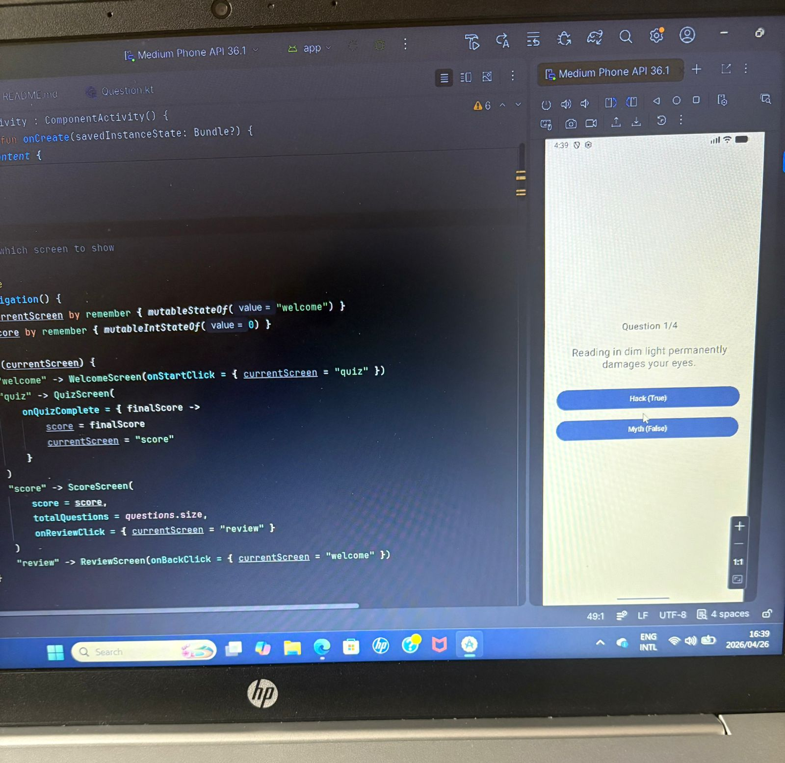
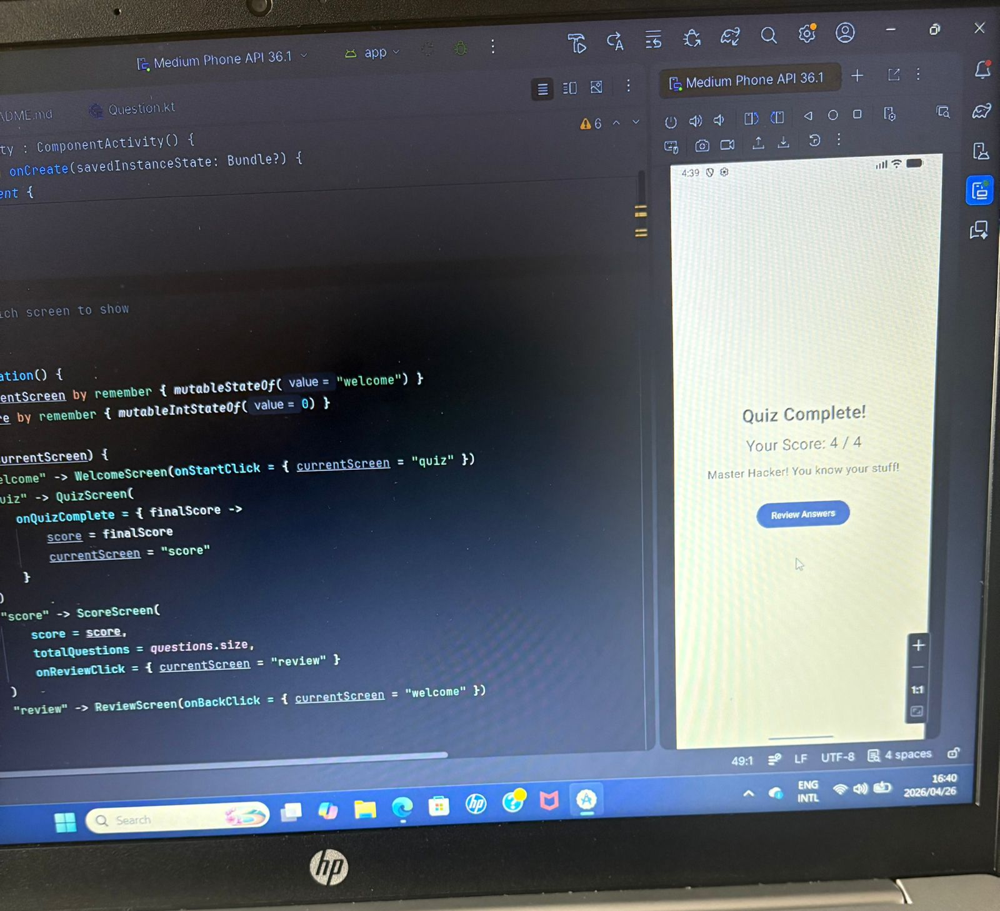
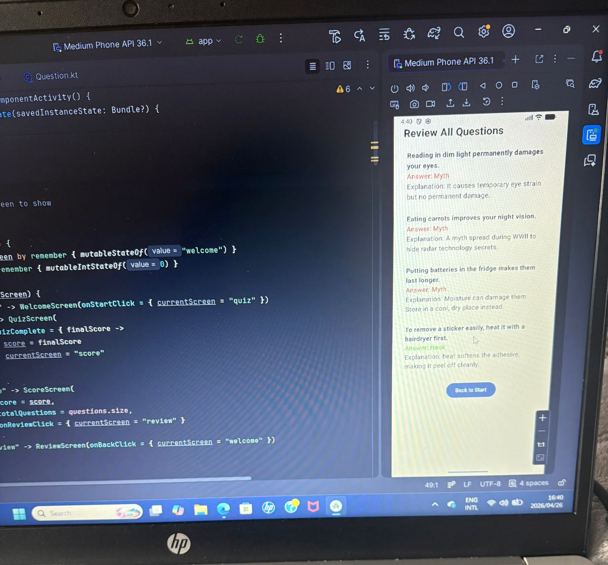

APP REPORT

Purpose:
An interactive quiz app where users guess if statements are real life hacks or myths.

Design:
Built with Jetpack Compose for a modern, clean look. Simple navigation between Welcome, Quiz and Score screens.
Used a Question data class to store questions and answers clearly. State handling keeps track of score and current question.
User-friendly buttons and easy-to-read text.

GitHub & Actions:
Used GitHub for version control. Created a workflow file to automate building the project, which runs automatically to check code quality.
 
welcome screen

 
 
quiz screen

 
  
result screen

review screen

 

Video presentation: https://youtube.com/shorts/Jy5273fskqM?feature=share

References: 

Android Developers. (2023). *Jetpack Compose*. [Online]. Available at: https://developer.android.com/jetpack/compose (Accessed: 26 April 2026).

Android Developers. (2023). *Navigation in Compose*. [Online]. Available at: https://developer.android.com/jetpack/compose/navigation (Accessed: 26 April 2026).

Android Developers. (2023). *State in Compose*. [Online]. Available at: https://developer.android.com/jetpack/compose/state (Accessed: 26 April 2026).

Android Developers. (2023). *Building adaptive layouts*. [Online]. Available at: https://developer.android.com/develop/ui/compose/layouts/adaptive (Accessed: 26 April 2026).

GitHub Inc. (2022). *GitHub Actions*. [Online]. Available at: https://github.com/features/actions (Accessed: 26 April 2026).

JetBrains. (2024). *Kotlin Programming Language*. [Online]. Available at: https://kotlinlang.org (Accessed: 26 April 2026).
